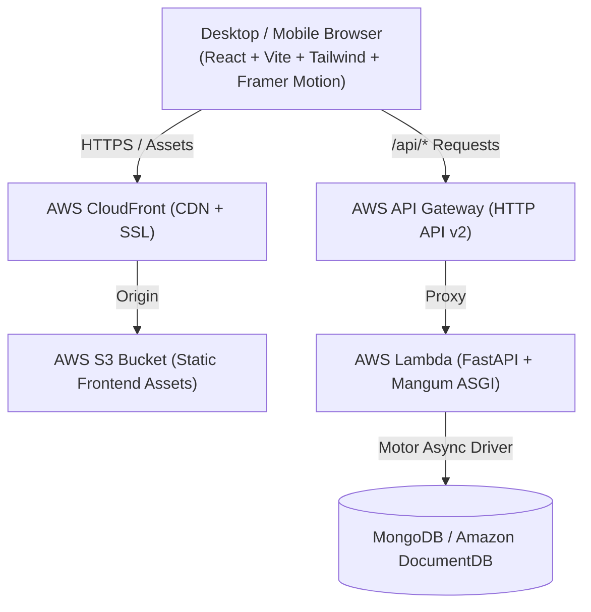

# 💎 Finlytics — Personal Finance & Wealth Intelligence Platform

> **Finlytics** is a personal finance and expense management platform built with modern web architecture and the **"Onyx & Amber"** design system.

---

## 🎨 Visual Identity & Design System

- **Palette**: Obsidian Dark (`#0E121A` / `hsl(225 22% 7%)`) as the base canvas paired with a signature Warm Amber (`#D97706` / `#F59E0B`) accent and emerald/ruby cashflow indicators.
- **Typography**: Display serif (**Playfair Display**) for editorial financial headers paired with high-legibility geometric sans (**Inter**) and monospaced tabular figures (`font-mono font-bold amount`) for money alignment.
- **Micro-Interactions**: Smooth glassmorphism (`backdrop-blur-md`), glowing borders (`shadow-glow-accent`), animated count-up numbers, accordion expands, and route transitions powered by `framer-motion`.
- **Command Palette**: Full keyboard-driven navigation (`Cmd/Ctrl+K`) powered by `cmdk`.

---

## 🚀 Key Features

### 1. Executive Financial Dashboard (`/dashboard`)
- **Key Metrics Row**: Net Cashflow Surplus/Deficit, Monthly Income, Monthly Spending, and Active Savings Rate with percentage trend comparisons.
- **Category Donut Chart**: Interactive Recharts breakdown with custom tooltip showing category totals and % of expense pool.
- **Daily Cumulative Balance Trend**: Area chart illustrating net cashflow trajectory across days of the active month.
- **Recent Transactions & Monthly Budget Progress**: Quick action cards with direct drill-down links.

### 2. Full Transactions Management (`/transactions`)
- **Data Table**: Sticky header, sortable columns (Date, Amount, Category), and deterministic category badge color mapping across renders.
- **Smart Filter Bar**: Custom date range picker popover with quick presets ("This Month", "Last 30 Days", "This Year", "All Time", "Custom Range"), category dropdown, income/expense toggle, and debounced search.
- **Slide-Over Drawer**: Create and edit transactions with `$ ` currency prefix, category icon previews, and smooth expanding recurring frequency options (`daily`, `weekly`, `monthly`, `yearly`).
- **Optimistic UI Updates**: Instant client-side state updates with automatic rollback and toast notifications on API failures.
- **CSV Data Hub**: Bulk CSV file import with drag-and-drop zone, progress bar, row-by-row error diagnostics, sample template download, and complete CSV export.
- **Safe Confirm Dialogs**: Accessible confirmation modal for deletes (no bare browser `confirm()`).

### 3. Monthly Budgets & Pace Tracking (`/budgets`)
- **Category Budget Cards**: Progressive progress bars (<80% calm green, 80-100% amber, >100% red), remaining pool in large typography, and daily safe-to-spend estimations.
- **Month Context**: Live days-left-in-month counter.
- **Subtle Alert Banner**: Proactive, non-intrusive warning when any category reaches >90% or exceeds its allocated limit.
- **Inline Editable Limits**: Quick in-place limit adjustments with instant optimistic calculation updates.

### 4. Global Command Palette (`Cmd/Ctrl+K`)
- Instant keyboard search across all views, "+ Add Transaction" shortcuts, category budget management, and dark/light theme toggle.

---

## 🏛 Architecture Diagram



---

## 🛠 Tech Stack

| Layer | Technologies |
| :--- | :--- |
| **Frontend** | React 18, TypeScript, Vite, Tailwind CSS, Recharts, Framer Motion, Cmdk, Lucide Icons |
| **Backend** | Python 3.11, FastAPI, Pydantic v2, Motor (Async MongoDB), Passlib & Bcrypt, PyJWT |
| **Testing** | Vitest + React Testing Library (Frontend), Pytest + Asyncio (Backend) |
| **Infrastructure** | Shell Scripts (Bash & PowerShell), AWS CLI, AWS S3, CloudFront, Lambda, API Gateway, Amazon DocumentDB / MongoDB Atlas |

---

## 💻 Local Development Setup

### Prerequisites
- Node.js 18+ & npm
- Python 3.10+
- MongoDB instance (local or MongoDB Atlas connection URI)

### 1. Backend Setup
```bash
cd finance-app/backend

# Create and activate virtual environment
python -m venv .venv
# On Windows:
.venv\Scripts\activate
# On macOS/Linux:
source .venv/bin/activate

# Install dependencies
pip install -r requirements.txt

# Configure environment variables
cp .env.example .env

# Run FastAPI server
uvicorn app.main:app --reload --host 127.0.0.1 --port 8000
```
API Documentation will be accessible at `http://127.0.0.1:8000/docs`.

### 2. Frontend Setup
```bash
cd finance-app/frontend

# Install dependencies
npm install

# Start Vite development server
npm run dev
```
Web App will be accessible at `http://localhost:5173`.

---

## 🧪 Running Tests

### Frontend Test Suite (Vitest & React Testing Library)
```bash
cd finance-app/frontend
npm test
```

### Backend Test Suite (Pytest)
```bash
cd finance-app/backend
pytest
```

---

## 🚀 AWS Serverless Deployment (Pure Shell Scripts & AWS CLI)

Deploy frontend and backend with pure shell scripts (no Terraform required):

```bash
# Frontend Deployment (AWS S3 & CloudFront):
./scripts/deploy-aws-cli.sh

# On Windows PowerShell:
.\scripts\deploy-aws-cli.ps1
```

---

## 📄 License
MIT © 2026 Finlytics Inc.
